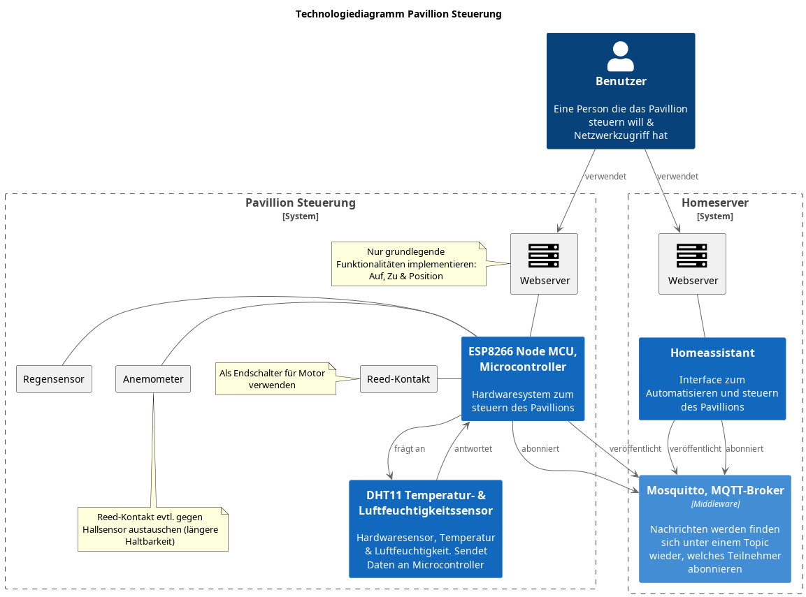
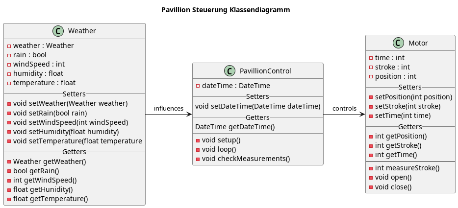

# Dokumentation

## Planung

### Technologiediagramm

Stellt eine Übersicht der einzelnen Systeme und Komponenten dar, sowie deren
Beziehung untereinander:

### Klassendiagramm

Stellt Klassen und Objekte sowie deren Bezihung dar, für die Softwareimplementierung
erstellt:

### Materialliste

Bauteile die für die Steuerung benötigt werden. Komponenten ohne Preis sind
bereits vorhanden.

| Bezeichnung  | Anzahl | Beschreibung                             | Preis |
| ------------ | ------ | ---------------------------------------- | ----- |
| Anemometer   | 1      | Messen der Wingeschwindigkeit            | ~30€  |
| Reed-Kontakt | 2      | Endschalter für Linearmotor              | -     |
| DHT11        | 1      | Temperatur- & Luftfeuchtigkeitssensor    | -     |
| H-Brücke     | 1      | Motor Drehrichtung umschalten (min. 48W) | ~20€  |
| Netzteil     | 1      | Versorgung der Steuerung (min. 60W)      | ~40€  |
| Gehäuße      | 1      | -                                        | ~15€  |
| ESP8266 MCU  | 1      | Microcontroller zum steuern              | -     |
| Regensensor  | 1      | Detektieren von Niederschlag             | ~6€   |

